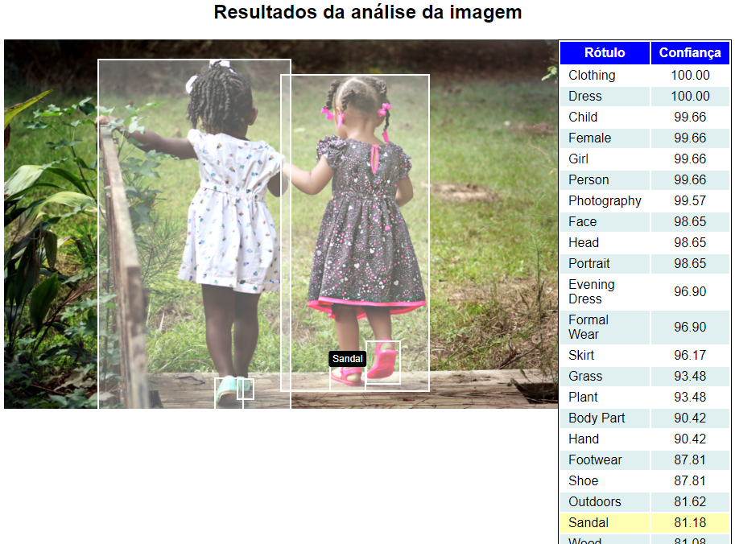
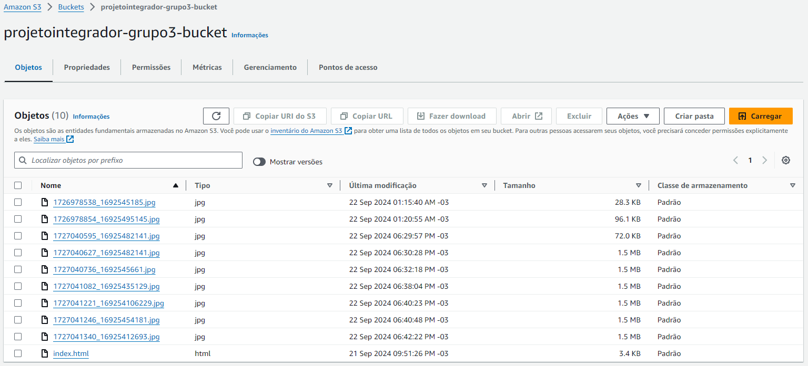
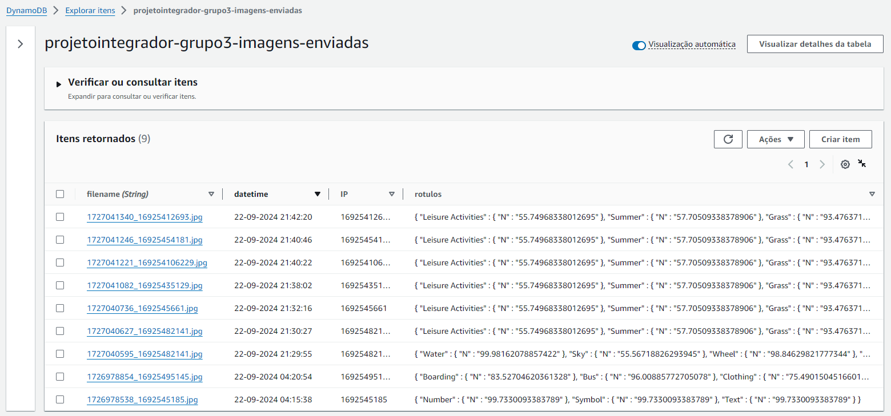
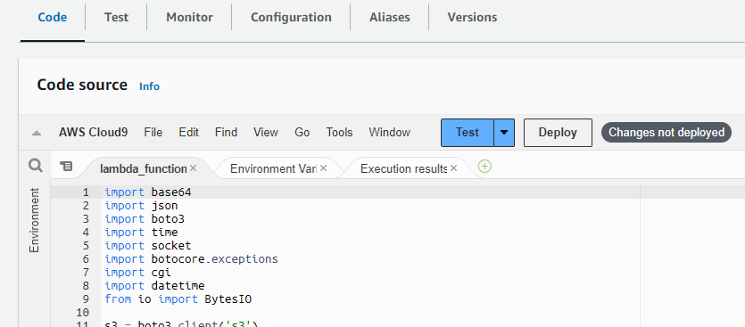
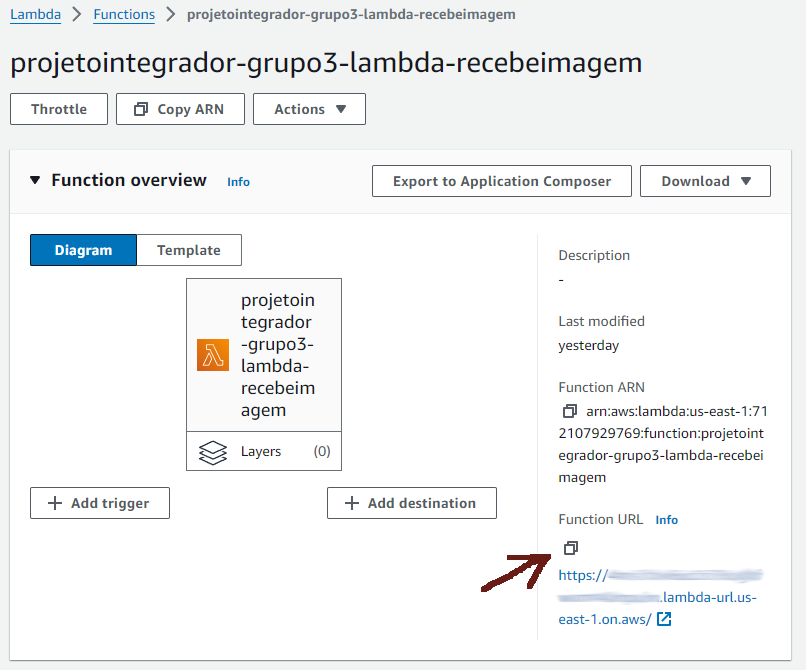
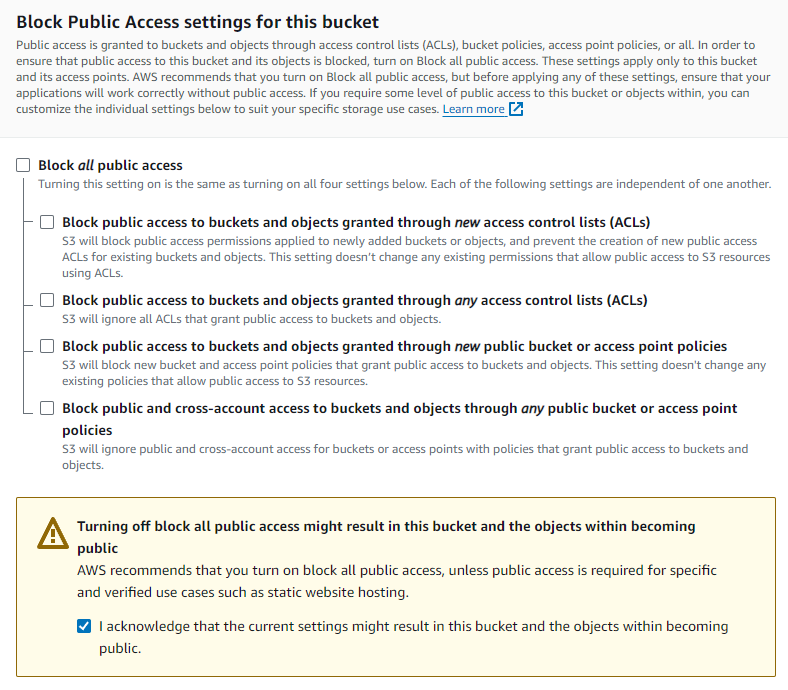
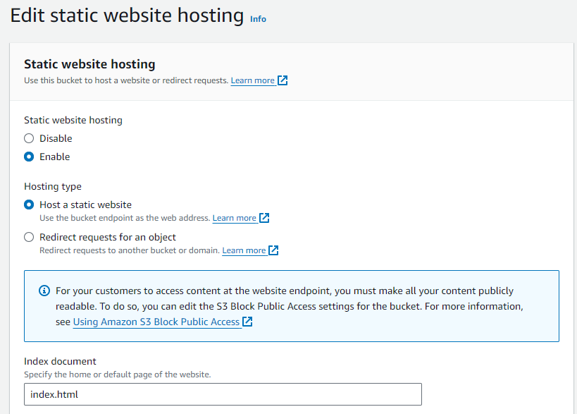
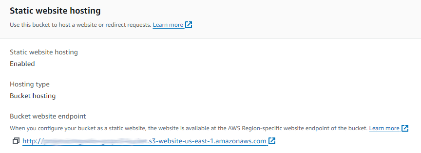

# Serverless AI Image Analyzer

This project aims to consolidate the knowledge acquired during the "AWS Cloud Solutions Architect - Associate" readiness course by Proz, integrating **S3**, **Amazon Rekognition** and **DynamoDB** using a **Python** **Lambda function**.

- [Serverless AI Image Analyzer](#serverless-ai-image-analyzer)
  - [Objective](#objective)
  - [Presentation](#presentation)
  - [Screenshots](#screenshots)
  - [AWS Services used](#aws-services-used)
  - [Architecture](#architecture)
  - [Workflow](#workflow)
  - [Putting it to work](#putting-it-to-work)
    - [Preparing Lambda](#preparing-lambda)
    - [Preparing S3 bucket](#preparing-s3-bucket)
    - [Preparing DynamoDB](#preparing-dynamodb)
    - [Setting Permissions](#setting-permissions)
    - [Now run it!](#now-run-it)
  - [Notes](#notes)
  - [Possible Improvements](#possible-improvements)
  - [Acknowledgements](#acknowledgements)
  - [Authors](#authors)
  - [License](#license)

## Objective

This is a **serverless** application receives an image from internet users through an online form, processes it with Artificial Intelligence and describes what is on it (objects, persons, structures, etc.).

Response page has mouseover interaction to show identified label boxes. The image is saved as an object in a S3 bucket and the result is written to a DynamoDB table, for future use.

It uses **AWS** services and infrastructure, but works serverless - i.e. we don't need a VM running to do the magic, what results in very low cost.

## Presentation

[Watch this video](https://www.youtube.com/watch?v=pEYolpI2dus) to see the application in action. You can turn on English subtitles.

## Screenshots

Submission Form


Response page



Images stored in bucket



Data stored in DynamoDB



## AWS Services used

**AWS Lambda**

Receives data from the user, processes it and shows response

**Amazon Rekognition**

Process the image to describe what is on it

**Amazon S3**

Contains the home page with the submission form, stores the received image

**Amazon DynamoDB**

Stores the results from image analysis

## Architecture


## Workflow

1. User:

    - Access a public submission form, that is stored in a S3 Bucket
    - Sends an jpeg or png image with a maximum of 2 Mb size

2. Lambda function:

    - Receives the form submission via HTTP
    - Writes the file as an object in the S3 bucket
    - Calls Rekognition to process the image
    - Writes the Rekognition response to DynamoDB, along with the file name, date and time, source IP
    - Returns the Rekognition response to user via HTTP

## Putting it to work

### Preparing Lambda

1. Let's start creating the Lambda function. Configure it to run as a Python code and allow external calls (as we are not using API Gateway in this example)

   
   
2. After creating the Lambda function, edit it to paste our [python code](lambda_receiveimage/lambda_function.py) there, then click _Deploy_

   
3. At that same page, copy the Lambda endpoint URL and put it in the _form action_ parameter, inside our [index.html](docs/index.html)

   

```html
<form
    id="image-form"
    action="https://yourlambdaentrypointaddress.lambda-url.us-east-1.on.aws/"
    method="post"
    enctype="multipart/form-data"
></form>
```

### Preparing S3 bucket

1. Create your S3 bucket. Make sure to uncheck the _Block Public Access_ settings:
   
   
2. Upload `index.html` file to bucket
3. Go to bucket properties and enable _static website hosting_, setting our `index.html` file as the _Index document_

   
4. Now take note of the _website endpoint_ of this bucket. This will be our entry-point, the public URL users must access to send an image to be analyzed (it is located at the end of bucket's _Properties_ tab):

   

### Preparing DynamoDB

Create a DynamoDB table. For this example, we use "filename" as Partition key.


### Setting Permissions

Now that we created all resources (and we don't need to do it for Amazon Rekognition), we need to set permissions, so the Lambda function can access then at runtime.

When we create a Lambda function, AWS creates a default role for it with also a default policy, with permissions to write logs at CloudWatch. What we need to do is add the permissions needed to use the other resources there.

1. Go to _IAM > Roles_ and find your Lambda role there. Search for the name you gave to it at creation time. Click on it.

   
2. In the next screen, copy this role ARN. You will need it later.

   
3. You will see a _policy_ for this role. Click on it.

   
4. Now click on Edit button to edit the policy code

   
5. Taking into account the [principle of least privilege](https://en.wikipedia.org/wiki/Principle_of_least_privilege), give permissions just to what this code really needs to use. You can try to do it by the console interface, or can just skip that insert the rules by hand. Anyway, if you do it right your final code must be something like this:

```json
{
    "Version": "2012-10-17",
    "Statement": [
        {
            "Effect": "Allow",
            "Action": "logs:CreateLogGroup",
            "Resource": "arn:aws:logs:us-east-1:ACCOUNT_ID:*"
        },
        {
            "Effect": "Allow",
            "Action": ["logs:CreateLogStream", "logs:PutLogEvents"],
            "Resource": [
                "arn:aws:logs:us-east-1:ACCOUNT_ID:log-group:/aws/lambda/LAMBDA_FUNCTION_NAME:*"
            ]
        },
        {
            "Sid": "Rekognition",
            "Effect": "Allow",
            "Action": ["rekognition:DetectLabels"],
            "Resource": "*"
        },
        {
            "Sid": "DynamoDB",
            "Effect": "Allow",
            "Action": ["dynamodb:PutItem"],
            "Resource": [
                "arn:aws:dynamodb:us-east-1:ACCOUNT_ID:table/TABLE_NAME"
            ]
        }
    ]
}
```

5. At last, check S3 bucket permissions to see if our `index.html` is public to everyone. And add permissions to let our Lambda function insert objects there. You can change this at bucket's _Permissions_ tab. Paste that role ARN you copied up there. The final code must be something like this:

```json
{
    "Version": "2012-10-17",
    "Id": "Policy1726768723312",
    "Statement": [
        {
            "Sid": "stmt-leitura-index",
            "Effect": "Allow",
            "Principal": "*",
            "Action": "s3:GetObject",
            "Resource": "arn:aws:s3:::BUCKET_NAME/index.html"
        },
        {
            "Sid": "stmt_gravacao_imagem",
            "Effect": "Allow",
            "Principal": {
                "AWS": "LAMBDA_ROLE_ARN"
            },
            "Action": "s3:PutObject",
            "Resource": "arn:aws:s3:::BUCKET_NAME/*"
        }
    ]
}
```

### Now run it!

To use it, just call in a browser that *bucket http endpoint* you copied at [Preparing S3 bucket](#preparing-s3-bucket) last step. Hooray!

## Notes

-   AWS Rekognition is available only in some regions, make sure it is available where you are creating your structure (`us-east-1` is a good choice).
-   You can contribute with improvements, see the [Possible Improvements](#possible-improvements) section below. Create a fork and make a Pull Request when ready.
-   This project is for educational purposes and should not be used in production. There are some security issues to be addressed.
-   The responsibility for the use of this project is the user's. The author is not responsible for any damage or loss arising from the use of this project.
-   This project is subject to change without notice.

## Possible Improvements

-   Check file size on the back end (it is being checked just on front end)
-   Optimize Lambda function to save on S3 bucket asynchronously
-   Use Amazon Cognito for OAuth login, so we will know who sent each image, preventing abuse and banning abusers
-   Set a daily usage limit (after OAuth validation) to avoid overloading the system
-   Allow only the original form as origin, to avoid someone using our lambda function in another application elsewhere
-   Turn this function into an API and use API Gateway to access it, improving security
-   Create a report page with information about the images sent, reading what was stored into DynamoDB and S3
-   Centralize permissions, as some are in the Lambda policy and others in the S3 bucket

## Acknowledgements

-   [Proz Educação](https://prozeducacao.com.br/)
-   [AWS](https://github.com/aws)
-   [Tomas Alric](https://github.com/tomasalric)

## Authors

- Willian Cruz

    [](https://linkedin.com/in/wcruz) [](https://github.com/wcruz-br)

- Caio Nunes Santos

    [](http://www.linkedin.com/in/caionscloud) [](https://github.com/CaioNS90)

## License

<p xmlns:cc="http://creativecommons.org/ns#" >This work is licensed under <a href="https://creativecommons.org/licenses/by-nc-sa/4.0/?ref=chooser-v1" target="_blank" rel="license noopener noreferrer" style="display:inline-block;">CC BY-NC-SA 4.0 </a></p>